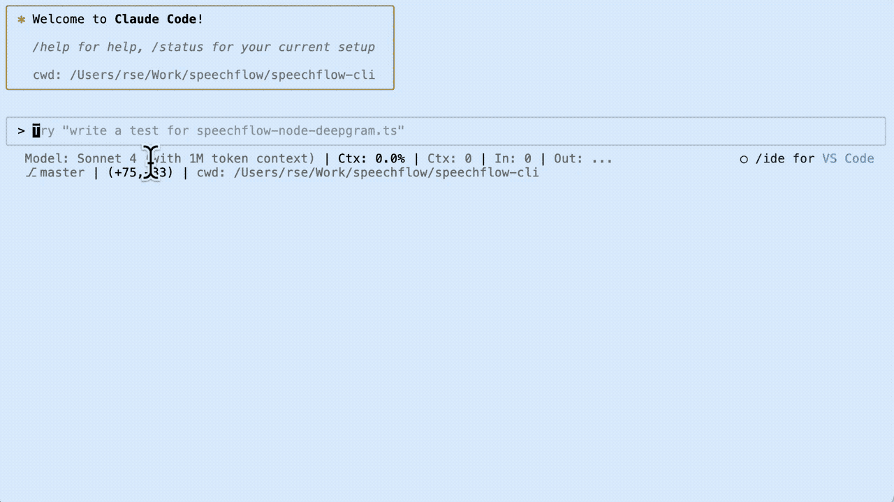

Claude Code Setup
=================

[Claude Code](https://www.anthropic.com/claude-code) is a really
awesome and extremely versatile generative AI based tool for
agentic coding support. It ships as a [Node.js](https://nodejs.org)
based command-line interface, but has built-in integration support for
both IDEs like [Visual Studio Code](https://code.visualstudio.com/)
and arbitrary [MCP servers](https://github.com/modelcontextprotocol/servers).

This is [Dr. Ralf S. Engelschall](https://engelschall.com)'s opinionated
setup for Claude Code. If you disagree on any aspect, please just
don't use it. The main purpose of this repository is to help
[Dr. Ralf S. Engelschall](https://engelschall.com) and
his friends and colleagues to quickly setup Claude Code in the same
configuration on multiple computers.

Sneak Preview
-------------

A simple sneak preview of some of the configured features is:



Features
--------

This particular Claude Code setup has the following features:

- The `claude update` command allows update a convenient update of the
  installation, because companion tools have to be also updated and the
  `claude` tool has to be re-tweaked/re-patched after every update.

- The `claude` command now always picks up user and non-project specific
  system prompt from `~/claude/prompt.md`, because certain instructions
  are always reasonable to give.

- The `claude` command now always picks up and assembles non-standard
  context files `etc/claude.md` or `.claude/CLAUDE.md` from projects
  into the central (temporary) `~/.claude/CLAUDE.md`, as the default of
  `CLAUDE.md` (in a project top-level) clutters projects.

- The MCP servers, the `LLM` agent and `/llm` command allows convenient
  access to foreign LLMs like OpenAI ChatGPT, Google Gemini, DeepSeek, and
  xAI Grok.

- The Claude Code status line displays essential LLM and Git information,
  which are useful during AI assistance sessions.

- The Claude Code colors follow the usual discreet blue/brown color scheme of
  [Dr. Ralf S. Engelschall](https://engelschall.com), as the default coloring
  is too colorful.

- The following custom commands provide standard reusable functionalties,
  and are the heart of this Claude Code setup:

  - [changes](.claude/commands/changes.md): 
    Complete *ChangeLog* entries based on Git commit messages.
  - [craft](.claude/commands/craft.md): 
    Craft new source code.
  - [explain](.claude/commands/explain.md): 
    Explain existing source code.
  - [lint](.claude/commands/lint.md): 
    Lint (analyze) existing source code.
  - [nope](.claude/commands/nope.md): 
    Reject a proposed code change and continue processing.
  - [hint](.claude/commands/hint.md): 
    Give essential hints on certainly questions.
  - [llm](.claude/commands/llm.md): 
    Query foreign Large Language Model (LLM).
  - [quorum](.claude/commands/quorum.md): 
    Query multiple foreign Large Language Model (LLM) for a quorum answer.
  - [why](.claude/commands/why.md): 
    Use the "Five-Why" method to analyize the root-cause of a problem.
  - [ref](.claude/commands/ref.md): 
    Use the Ref MCP server to read Web information into context.

Setup
-----

To setup Claude Code, just follow the following few steps:

1. **PREREQUISITE**:

   Install [Node.js](https://nodejs.org) globally into your system 
   and ensure that the `node`, `npm` and `npx` commands are in your `$PATH`.

2. **INSTALL SCRIPT AND CONFIG**:

   Install the content of this repository into your home directory:
  
   ```sh
   $ git clone https://github.com/rse/claude-code-setup
   $ cd claude-code-setup
   $ ./setup install [<prefix>]
   ```

   This installs the `claude` wrapper script into `<prefix>/bin/claude`
   and the configuration files into `<prefix>/.claude/`.

3. **INSTALL CLAUDE CODE**:

   Install [Claude Code](https://www.anthropic.com/claude-code) and
   the companion tools [TweakCC](https://github.com/Piebald-AI/tweakcc),
   [CCStatusLine](https://github.com/sirmalloc/ccstatusline), and
   [Any-Chat-Completions-MCP](https://github.com/pyroprompts/any-chat-completions-mcp)
   with the help of the `claude` wrapper:

   ```sh
   $ sudo claude install
   ```

   > Notice: do not forget to regularily run `sudo claude update` later!

4. [Optional] **SETUP LLM MCP**:

   Optionally, and only for the custom `/quorum` and `/llm` commands:

   Get API access keys for:

   - OpenAI ChatGPT (directly)
   - Google Gemini  (directly)
   - Deepseek       (directly)
   - xAI Grok       (via OpenRouter)

   Store those access keys in the following environment variables:

   ```
   CLAUDE_CODE_KEY_OPENAI_CHATGPT="..."
   CLAUDE_CODE_KEY_GOOGLE_GEMINI="..."
   CLAUDE_CODE_KEY_DEEPSEEK="..."
   CLAUDE_CODE_KEY_OPENROUTER="..."
   ```

   Then instanciate the corresonding MCP servers (adds entries to `~/.claude.json`):

   ```sh
   claude mcp add --scope user --transport stdio \
       -e AI_CHAT_KEY="$CLAUDE_CODE_KEY_OPENAI_CHATGPT" \
       -e AI_CHAT_NAME="OpenAI ChatGPT" \
       -e AI_CHAT_MODEL="gpt-5" \
       -e AI_CHAT_BASE_URL="https://api.openai.com/v1" \
       -- chat-openai-chatgpt any-chat-completions-mcp
   claude mcp add --scope user --transport stdio \
       -e AI_CHAT_KEY="$CLAUDE_CODE_KEY_GOOGLE_GEMINI" \
       -e AI_CHAT_NAME="Google Gemini" \
       -e AI_CHAT_MODEL="gemini-2.5-flash" \
       -e AI_CHAT_BASE_URL="https://generativelanguage.googleapis.com/v1beta/openai/" \
       -- chat-google-gemini any-chat-completions-mcp
   claude mcp add --scope user --transport stdio \
       -e AI_CHAT_KEY="$CLAUDE_CODE_KEY_DEEPSEEK" \
       -e AI_CHAT_NAME="DeepSeek" \
       -e AI_CHAT_MODEL="deepseek-chat" \
       -e AI_CHAT_BASE_URL="https://api.deepseek.com/v1" \
       -- chat-google-gemini any-chat-completions-mcp
   claude mcp add --scope user --transport stdio \
       -e AI_CHAT_KEY="$CLAUDE_CODE_KEY_OPENROUTER" \
       -e AI_CHAT_NAME="xAI Grok" \
       -e AI_CHAT_MODEL="x-ai/grok-code-fast-1" \
       -e AI_CHAT_BASE_URL="https://openrouter.ai/api/v1" \
       -- chat-xai-grok any-chat-completions-mcp
   ```

5. [Optional] **SETUP GITHUB MCP**:

   Optionally, and only for the custom `/github` command:

   Get a your [Github Private Access Token](https://github.com/settings/personal-access-tokens/new)
   for API access and store it in an environment variable:

   ```
   CLAUDE_CODE_KEY_GITHUB="..."
   ```

   Then add the corresonding MCP server (adds entry to `~/.claude.json`):

   ```sh
   claude mcp add --scope user --transport http \
       github https://api.githubcopilot.com/mcp \
       -H "Authorization: Bearer $CLAUDE_CODE_KEY_GITHUB"
   ```

6. [Optional] **SETUP REF MCP**:

   Optionally, and only for the custom `/ref` command:

   Get a your [Ref](https://ref.tools) account for API access
   and store it in an environment variable:

   ```
   CLAUDE_CODE_KEY_REF="..."
   ```

   Then add the corresonding MCP server (adds entry to `~/.claude.json`):

   ```sh
   claude mcp add --scope user --transport http \
       -- ref "https://api.ref.tools/mcp?apiKey=$CLAUDE_CODE_KEY_REF"
   ```

7. **GET ACCESS TO CLAUDE CODE**:

   Access to Claude Code:Here you have two options:

   - [Claude Code Free/Pro/Max-5x/Max-20x subscription](https://www.anthropic.com/claude-code#get-started) (recommended)
   - [Anthropic API subscription](https://www.anthropic.com/pricing) (alternatively)

   > Notice: the first option provides access to Anthrophic Claude only
   > via Web interfaces and to the API only indirectly via Claude Code, while
   > only the second option also allows direct access to the Anthropic Claude API.

   > Notice: the first option is best for Claude Code because it has less limits
   > and is more cost effective. The second option is more versatile, as you
   > can use this subcription for more than just Claude Code.

8. **LOGIN TO CLAUDE CODE**:

   Login to [Claude Code](https://www.anthropic.com/claude-code):

   ```
   $ claude
   /login
   ```

Copyright & License
-------------------

Copyright &copy; 2025 [Dr. Ralf S. Engelschall](mailto:rse@engelschall.com)<br/>
Licensed under [MIT](https://spdx.org/licenses/MIT)

